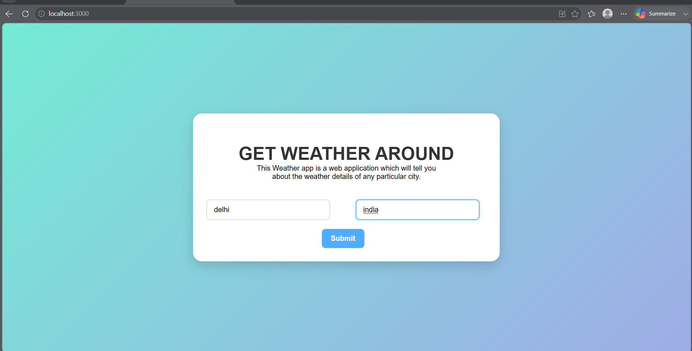
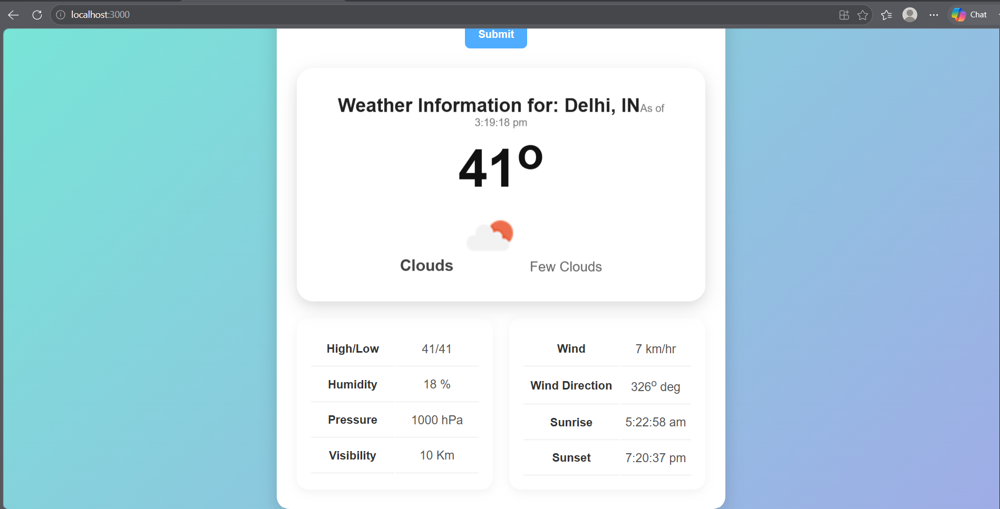

# React Weather App
A responsive weather application built using ReactJS and the OpenWeatherMap API. Users can search for any city and get real-time weather information including temperature, weather conditions, humidity, wind speed, and more.

## Features
* Search weather by city and country
* Real-time weather data
* Temperature display
* Weather condition and weather icon
* Humidity information
* Wind speed details
* Responsive user interface

## Screenshots

### Home Page



### Weather Result




## Installation
Clone the repository:

```bash
git clone https://github.com/deb811/React-Weather-app.git
```

Navigate to the project directory:

```bash
cd React-Weather-app
```

Install dependencies:

```bash
npm install
```

Start the application:

```bash
npm start
```

Open:

```text
http://localhost:3000
```

in your browser.

## Configuration
Add your OpenWeatherMap API key in:

```text
src/components/Weather.js
```

## Tech Stack
* ReactJS
* JavaScript (ES6)
* HTML5
* CSS3
* OpenWeatherMap API

## Project Structure
```text
src/
├── components/
│   ├── Weather.js
│   ├── DisplayWeather.js
│   ├── weather.css
│   └── displayweather.css
├── App.js
└── index.js
```

## Future Improvements
* 5-Day Weather Forecast
* Dark Mode Support
* Geolocation-based Weather Search
* Improved UI/UX

## Author
Debashis
GitHub: https://github.com/deb811

